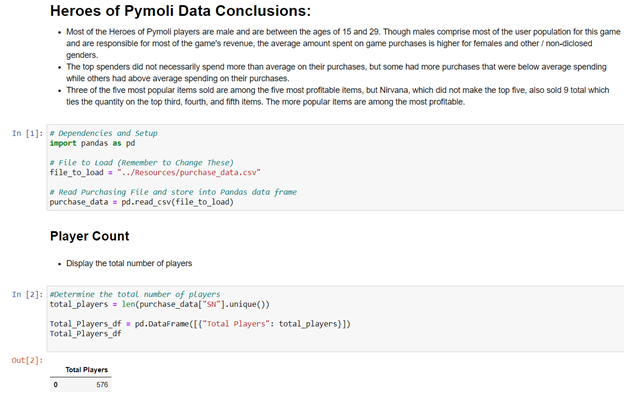
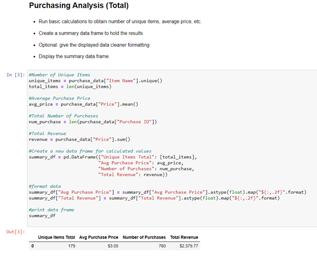
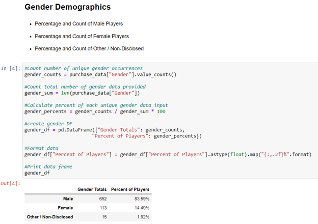
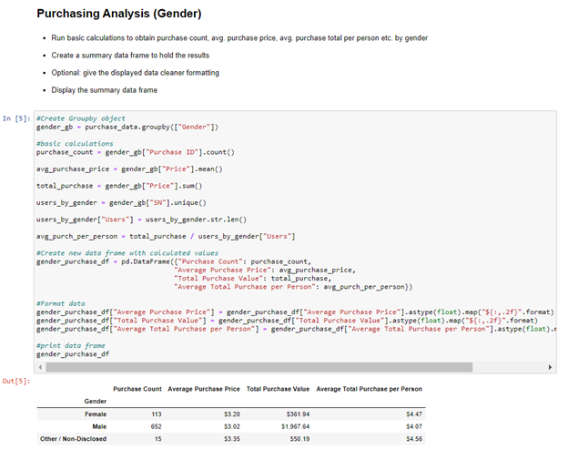
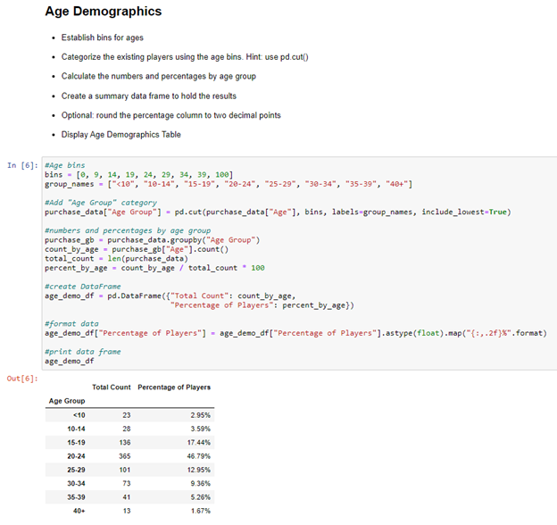
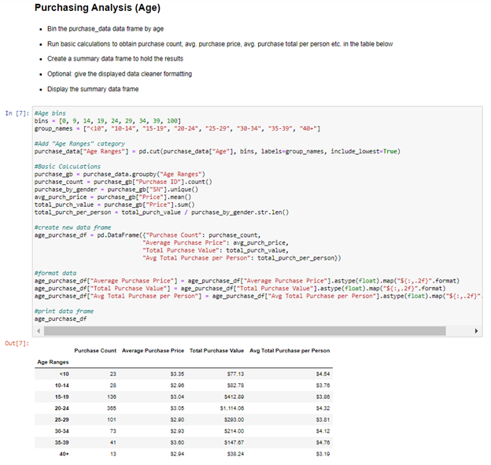
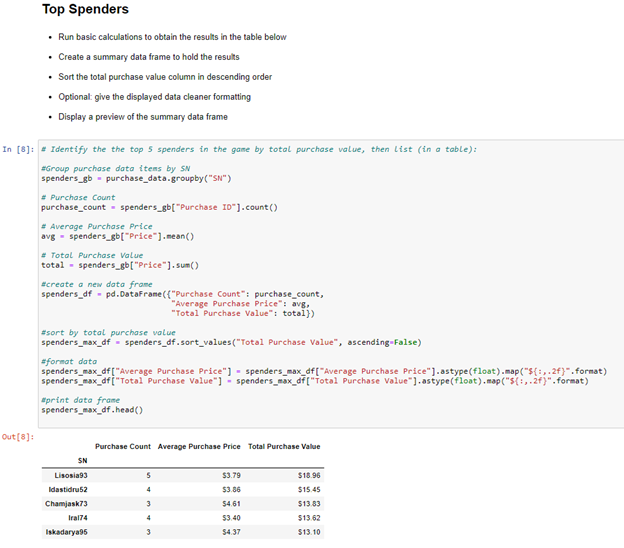
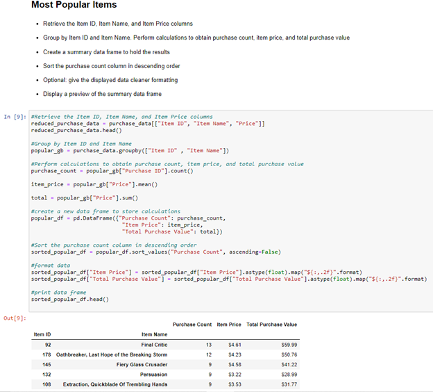
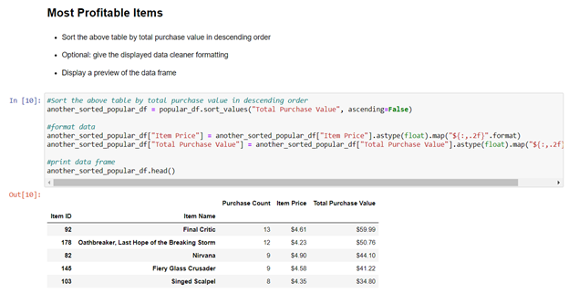

Heroes of Pymoli models data from an online game that is free to play with online purchase options.  This report generates a break down of the game's purchasing data based on age, gender, and popularity to provide meaningful insight into primary users and feature popularity.

